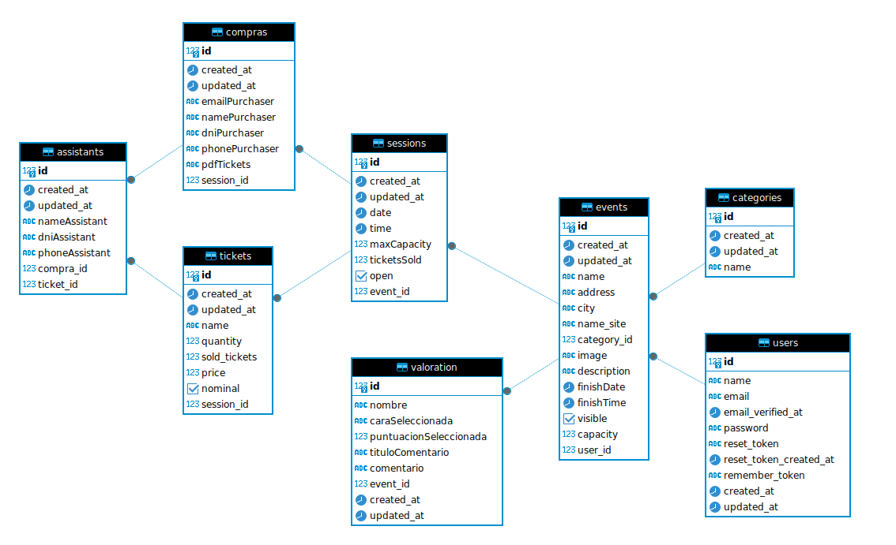

= TICKETPLANET 

:toc-title: ÍNDICE
:figure-caption: Figura
:table-caption: Taula   
:example-caption: Exemple
:author: Adria Bernabeu, Salma Picazo, Andres Rojas
:revnumber: 1.12
:doctype: book
:encoding: utf-8
:lang: es
:toc: left
:toclevels: 5
:sectnums:
:icons: font   
:numbered:

== INTRODUCCIÓN

*TicketPlanet*

image::Images/Logo.png[Logo principal, width=10%]

*Miembros*  

- Adria Bernabeu

- Salma Picazo

- Andres Rojas

=== Objetivo de la aplicación

TicketPlanet facilita a los usuarios la compra de entradas de diferentes tipos de eventos, gracias a su plataforma intuitiva y segura.


== DISEÑO

=== Base de datos

==== Diagrama de clases


[plantuml,,png]
----

class Assistant {
    nameAssistant: string
    dniAssistant: string
    phoneAssistant: string
    compra_id: integer
    ticket_id: integer
        
    + compra() : Compra
    + ticket() : Ticket
}
    
class Category {
    id: int
    name: string
        
    + events() : List<Event>    
}
    
class Compra {
    id: int
    emailPurchaser: string
    namePurchaser: string
    dniPurchaser: string
    phonePurchaser: string
    pdfTickets: string
    session_id: integer
        
    + session() : Session
}
    
class Event {
    id: int
    name: string
    address: string
    city: string
    name_site: string
    image: string
    description: string
    finishDate: date
    finishTime: time
    visible: boolean
    capacity: integer
    category_id: integer
    user_id: integer
        
    + category() : Category
    + user() : User
    + sessions() : List<Session>
    + valoraciones() : List<Valoracion>
}
    
class Session {
    id: int
    date: date
    time: time
    maxCapacity: integer
    ticketsSold: integer
    open: boolean
    event_id: integer
        
    + tickets() : List<Ticket>
}
    
class Ticket {
    id: int
    name: string
    quantity: integer
    price: float
    sold_tickets: integer
    nominal: boolean
    session_id: integer
        
    + session() : Session
}
    
class User {
    id: int
    name: string
    email: string
    password: string
    reset_token: string
    reset_token_created_at: datetime
}
    
class Valoracion {
    id: int
    nombre: string
    caraSeleccionada: string
    puntuacionSeleccionada: integer
    tituloComentario: string
    comentario: string
    event_id: integer
        
    + event() : Event
}
    
Assistant "1" -- "0..1" Compra
Assistant "1" -- "0..1" Ticket
    
Compra "1" -- "0..1" Session
    
Event "0..n" -- "1" Category
Event "1" -- "1" User
Event "1" -- "0..n" Session
Event "1" -- "0..n" Valoracion
    
Session "1" -- "0..n" Ticket
----

==== Diagrama E-R:


=== Interfícies
    
==== Sketching
Link de los sketching de los Mockups https://www.figma.com/file/V47MqQzp5biMSzsQ5m7gZU/Mockups?type=design&node-id=0-1&mode=design&t=IMIfO6zr6hBVFlYG-0[aquí]. 

==== Figma
Link a las interfícies de Figma https://www.figma.com/file/V47MqQzp5biMSzsQ5m7gZU/Mockups?type=design&node-id=0-1&mode=design&t=IMIfO6zr6hBVFlYG-0[aquí]. 

=== Guía de estilos
Link a la guía de estilos de Figma https://www.figma.com/file/V47MqQzp5biMSzsQ5m7gZU/Mockups?type=design&node-id=0-1&mode=design&t=IMIfO6zr6hBVFlYG-0[aquí].

== MANUAL DE INSTALACIÓN SERVER

=== Paso 1: Instalar Apache

Instala Apache en tu servidor Debian

```bash
sudo apt update
sudo apt install apache2
```

Habilita el módulo de Apache necesario para ejecutar aplicaciones PHP.

```bash
sudo a2enmod php8.2
sudo systemctl restart apache2
```

=== Paso 2: Instalar PHP y Extensiones Necesarias

```bash
sudo apt install php7.4 sudo apt install php8.2-curl php8.2-dom php8.2-mbstring php8.2-xml php8.2-pgsql zip unzip
```

=== Paso 3: Descargar proyecto laravel

```bash
cd /var/www/
git pull https://git.copernic.cat/abernabeu/gr3-bernabeu-rojas-picazo.git
```
=== Paso 4: Configurar conexión a base de datos

```bash
cd /var/www/gr3-bernabeu-rojas-picazo/ticketplanet
cp .env.example .env
```
Modficar el archivo .env 

```bash
DB_CONNECTION=pgsql
DB_HOST=127.0.0.1
DB_PORT=5432
DB_DATABASE=ticketplanet
DB_USERNAME=usuario
DB_PASSWORD=1234
```

Añadimos uns parámetros de configuración necesarios para el proyecto en el .env

```bash
PAGINATION_LIMIT=10
EVENT_LIMIT_HOME=6
PASARELA_PAGAMENT = true
API_LOCAL= false
```

=== Paso 5: Configurar mailtrap

Para poder ver como se envian los correr con el app usaremos mailtrap. Para habilitar el mailtrap deberemos ir a la pagina de mailtrap 
"https://mailtrap.io/". Nos registramos y deberemos acceder a Email Testing > Inboxes > My Inbox > SMTP Settings. En Intregations 
Seleccionamos PHP >Laravel 9+ Y se motrara un parametros que deberan ponerse en el archivo env de la app.

Deberia quedar algo asi:

```bash
/var/www/gr3-bernabeu-rojas-picazo/ticketplanet/.env

MAIL_MAILER=smtp
MAIL_HOST=sandbox.smtp.mailtrap.io
MAIL_PORT=2525
MAIL_USERNAME=aed969b821e664
MAIL_PASSWORD=*********77831
```


=== Paso 6: Instalar Dependencias de Composer

Instala las dependencias de Composer para tu proyecto Laravel.

```bash
cd /var/www/gr3-bernabeu-rojas-picazo/ticketplanet
composer install --no-dev
```

=== Paso 7: Generar app key

```bash
cd /var/www/gr3-bernabeu-rojas-picazo/ticketplanet
php artisan key:generate
```

=== Paso 8: Dar permisos
```bash
cd /var/www/gr3-bernabeu-rojas-picazo/ticketplanet
chown -R www-data storage
chown -R www-data bootstrap/cache
```
```bash
chmod -R 755 storage
chmod -R 755 bootstrap/cache
```

=== Paso 9: Configurar Virtual Host de Apache

Crea un archivo de configuración de Virtual Host para tu proyecto Laravel

```bash
sudo nano /etc/apache2/sites-available/ticketplanet.conf
```
Pon el siguiente contenido:

```bash
<VirtualHost *:80>
    ServerName ticket.com
    DocumentRoot /var/www/gr3-bernabeu-rojas-picazo/ticketplanet/public

    <Directory /var/www/gr3-bernabeu-rojas-picazo/ticketplanet/public>
        Options Indexes FollowSymLinks
        AllowOverride All
        Require all granted
    </Directory>

    ErrorLog ${APACHE_LOG_DIR}/demo-error.log
    CustomLog ${APACHE_LOG_DIR}/demo-access.log combined
</VirtualHost>
```

Guarda y cierra el archivo. Luego, habilita el Virtual Host y reinicia Apache.

```bash
sudo a2ensite laravel
sudo systemctl restart apache2
```
=== Paso 10: Activar Docker
```bash
cd /var/www/gr3-bernabeu-rojas-picazo/docker/server
sudo docker compose up -d
```

=== Paso 11: Crear base de datos

```bash
cd /var/www/gr3-bernabeu-rojas-picazo/ticketplante
```

Ejecutamos el siguiente comando para crear base de datos.

```bash
sudo php artisan migrate
```

=== Paso 12: Instalar unaccent en Postgresql

Ejecutamos el siguiente comando para entrar a la terminal de postgresql 

```bash
sudo docker exec -it pg_container psql -U usuario  ticketplanet
```

Una vez en la terminal de postgresql ejecutamos el siguiente comando

```bash
CREATE EXTENSION unaccent;
```

=== Paso 13: Configurar docker con la base de datos del proyecto de la API

Accedemos a la carpeta api-imagenes y ejecutamos el siguiente comando:
```bash
cd api-imagenes
docker-compose up -d
```

=== Paso 14: Instalar composer en el proyecto de la api

```bash
cd api-imagenes/api-rest/
composer install
```

=== Paso 15: Configurar .env del proyecto api
Creamos el archivo .env

```bash
cd api-imagenes/api-rest/
cp .env.example .env
```
Editamos el archivo para congiurar el acceso a la base de datos en el proyecto

```bash
DB_CONNECTION=pgsql
DB_HOST=127.0.0.1
DB_PORT=9001
DB_DATABASE=api-rest
DB_USERNAME=usuario
DB_PASSWORD=1234
```
Añadimos un ultimo parámetro para configurar el puerto del proyecto en el 9000

```bash
SERVER_PORT=9000
```
=== Paso 16: Generar app_key para el proyecto de la api 

```bash
cd api-imagenes/api-rest/
php artisan key:generate
```
=== Paso 17: Hacer la migracion del proyecto 

```bash
cd api-imagenes/api-rest/
php artisan migrate
```
=== Paso 17: Generar un token para acceder a la api desde la app
Accedemos al proyecto y ejecutamos el proyecto "php artisan db:seed"

```bash
cd api-imagenes/api-rest/
php artisan db:seed
```
El comando debolvera un token. Este token lo deberdemos poner en el archivo .env del proyecto ticketplanet de la siguiene manera:

```bash
cd ticketplanet/
```
archivo .env:
```bash
API_KEY="a9yKqIWD4hqiLdBA0sat7ogQOVIwiRGYsu51XNEOa3a582a5"
```
=== Paso 18:Cambiar permisos del proyecto de la API

```bash
cd /var/www/gr3-bernabeu-rojas-picazo/api-imagenes/api-rest/
chown -R www-data storage
chown -R www-data bootstrap/cache
```
```bash
chmod -R 755 storage
chmod -R 755 bootstrap/cache
```

=== Paso 19: Añadir el proyecto a la configuracion de apache

Primero añadiremos un nuevo virtual host en el archivo ticketplanet.conf

```bash
sudo nano /etc/apache2/sites-available/ticketplanet.conf
```

```bash
<VirtualHost *:8080>
    ServerName api-imagenes.com
    DocumentRoot /var/www/gr3-bernabeu-rojas-picazo/api-imagenes/api-rest/public

    <Directory /var/www/gr3-bernabeu-rojas-picazo/api-imagenes/api-rest/public>
        Options Indexes FollowSymLinks
        AllowOverride All
        Require all granted
    </Directory>

    ErrorLog ${APACHE_LOG_DIR}/demo-error.log
    CustomLog ${APACHE_LOG_DIR}/demo-access.log combined
</VirtualHost>
```
Editamos el archivo ports.conf para configurar que el servicio de apache escuche el puerto 8080

```bash
sudo nano /etc/apache2/ports.conf
```
En el archivo ports.conf añadimos la siguiente linea:

```bash
Listen 8080
```

=== Paso 20: Activar API

Para que se pueda utilizar la API para guardar imagenes se tiene que activar el proyecto 

```bash
cd /var/www/gr3-bernabeu-rojas-picazo/api-imagenes/api-rest
```

```bash
sudo php artisan serve
```

== MANUAL DE INSTALACIÓN LOCAL

=== Paso 1: Descargar el proyecto de GitLab

```bash
git pull https://git.copernic.cat/abernabeu/gr3-bernabeu-rojas-picazo.git
```
=== Paso 2: Configurar docker con la base de datos del proyecto de la API

Accedemos a la carpeta api-imagenes y ejecutamos el siguiente comando:
```bash
cd api-imagenes
docker-compose up -d
```

=== Paso 3: Instalar composer en el proyecto de la api

```bash
cd api-imagenes/api-rest/
composer install
```

=== Paso 4: Configurar .env del proyecto api
Creamos el archivo .env

```bash
cd api-imagenes/api-rest/
cp .env.example .env
```
Editamos el archivo para congiurar el acceso a la base de datos en el proyecto

```bash
DB_CONNECTION=pgsql
DB_HOST=127.0.0.1
DB_PORT=9001
DB_DATABASE=api-rest
DB_USERNAME=usuario
DB_PASSWORD=1234
```
Añadimos un ultimo parámetro para configurar el puerto del proyecto en el 9000

```bash
SERVER_PORT=9000
```
=== Paso 4: Generar app_key para el proyecto de la api 

```bash
cd api-imagenes/api-rest/
php artisan key:generate
```
=== Paso 5: Hacer la migracion del proyecto 

```bash
cd api-imagenes/api-rest/
php artisan migrate
```
=== Paso 6: Configurar docker con la base de datos del proyecto de la app

Accedemos a la carpeta docker/dev y ejecutamos el siguiente comando:
```bash
cd docker/dev
docker-compose up -d
```

=== Paso 7: Instalar composer en el proyecto de la app

```bash
cd ticketplanet/
composer install
```

=== Paso 8: Configurar .env del proyecto app
Creamos el archivo .env

```bash
cd ticketplanet/
cp .env.example .env
```
Editamos el archivo para congiurar el acceso a la base de datos en el proyecto

```bash
DB_CONNECTION=pgsql
DB_HOST=127.0.0.1
DB_PORT=5432
DB_DATABASE=ticketplanet
DB_USERNAME=usuario
DB_PASSWORD=1234
```
Añadimos uns parámetros de configuración necesarios en el .env

```bash
PAGINATION_LIMIT=10
EVENT_LIMIT_HOME=6
PASARELA_PAGAMENT = true
API_LOCAL= true
```
=== Paso 9: Configurar mailtrap

Para poder ver como se envian los correr con el app usaremos mailtrap. Para habilitar el mailtrap deberemos ir a la pagina de mailtrap 
"https://mailtrap.io/". Nos registramos y deberemos acceder a Email Testing > Inboxes > My Inbox > SMTP Settings. En Intregations 
Seleccionamos PHP >Laravel 9+ Y se motrara un parametros que deberan ponerse en el archivo env de la app.

Deberia quedar algo asi:

```bash
/var/www/gr3-bernabeu-rojas-picazo/ticketplanet/.env

MAIL_MAILER=smtp
MAIL_HOST=sandbox.smtp.mailtrap.io
MAIL_PORT=2525
MAIL_USERNAME=aed969b821e664
MAIL_PASSWORD=*********77831
```


=== Paso 10: Generar app_key para el proyecto de la app 

```bash
cd ticketplanet/
php artisan key:generate
```
=== Paso 11: Hacer la migracion del proyecto 

```bash
cd ticketplanet/
php artisan migrate
```

=== Paso 12: Instalar unaccent en Postgresql

Ejecutamos el siguiente comando para entrar a la terminal de postgresql 

```bash
sudo docker exec -it pg_container psql -U usuario  ticketplanet
```

Una vez en la terminal de postgresql ejecutamos el siguiente comando

```bash
CREATE EXTENSION unaccent;
```

=== Paso 13: Generar un token para acceder a la api desde la app
Accedemos al proyecto y ejecutamos el proyecto "php artisan db:seed"

```bash
cd api-imagenes/api-rest/
php artisan db:seed
```
El comando debolvera un token. Este token lo deberdemos poner en el archivo .env del proyecto ticketplanet de la siguiene manera:

```bash
cd ticketplanet/
```
archivo .env:
```bash
API_KEY="a9yKqIWD4hqiLdBA0sat7ogQOVIwiRGYsu51XNEOa3a582a5"
```

=== Paso 14: Activar el proyecto

Para activiar el proyecto primero activamos la API

```bash
cd api-imagenes/api-rest/
php artisan serve
```

Una vez activamos la API activamos activamos la app

```bash
cd ticketplanet/
php artisan serve
```
Y en el navegador buscamos 127.0.0.1:8000

== DATOS DE PRUEBA REDYS

Tarjetas de crédito 
|===
|Numeración | Caducidad | CVV

|4918019160034602
|12/34
|123

|4548814479727229
|12/24
|123
|===

== DOCUMENTACIÓN API

 Las medidas de las imagenes generadas por la api son de 300, 600 y 1200 px. 
 
 Para implementar la función de redimensionar hemos utilzado la libreia Intervention Image. Utilizamos la clases Intervention\Image\ImageManager y Intervention\Image\Drivers\Gd\Driver, para crear un ImageManger.
 
```bash
$manager = new ImageManager(new Driver());
```

 Mediante el metodo read del manager recogemos la imagen recibida.

```bash
$imagen = $manager->read( $request->file('image'));
```

Usando el metodo resize del manager redimensionamos las imagenes indicando el with y heigth como parametros del metodo. 

```bash
 $size = 300
 $imagen->resize($size, $size);
```
Una vez redimensionada la imaagen utilizamos el metodo save para guardar la imagen en la ruta indicada en el parametro del metodo.

```bash
  $imagen->save($ruta);
```

Las imagenes se guardan en diferentes carpetas large, medium y small dependiendo de su tamaño. 

Para recuperar la imagenes se utiliza una URL /images/retrieve/{type}/{imageHash}. Donde "type" es el tamaño de la imagen y "imageHash" es el hash recibido al guardar la imagenes en la api.

Primero validamos si los parametros enviaados son correctos.
```bash
Validator::make(compact('type', 'imageHash'), [
            'type' => 'required|in:small,medium,large', 
            'imageHash' =>  ['required', 'string', new ExistsInDatabase()],
        ]);
```

Una vez validados los parametros buscamos la imagen solcitada y la enviamos.

```bash
  return response()->file($imagenPath);
```

En caso de que falle la validación devolvemos una imagen por defecto.

```bash
  $imagenPath = public_path('imagenes/large/event_default.jpg');
  return response()->file($imagenPath);
```

=== Docimentacion API OpenAPI

```bash
openapi: 3.1.0
info:
  title: api-imagenes
  description: |
    Esta API permite subir una imagen generando tres versiones de la imagen
    y pedir una de las versiones de una imagen subida.
  version: 1.0.0

paths:
  /images/store:
    post:
      summary: Recibe una imagen
      description: Recibe una imagen, genera tres versiones redimensionadas de la imagen 
      y las guarda para que puedan ser accesibles.
      requestBody:
        required: true
        content:
          multipart/form-data:
             schema:
               type: object
               properties:
                  image:
                    $ref: "#/components/schemas/imageData"
      responses:
        '200':
          description: Imagen subida exitosamente
          content:
            application/json:
              schema:
                $ref: "#/components/schemas/imageUploadSuccess"
        '422':
          description:  Error de validacion
          content:
            application/json:
              schema:
                $ref: "#/components/schemas/imageUploadSuccess"
                
      security:
        - bearerAuth: []
  
  /images/retrieve/{type}/{imageHash}:
    get:
      summary: Obtener una imagen
      description: Permite obtener una imagen del servidor segun su tipo y hash.
      parameters:
        - $ref: "#/components/parameters/typeParam"
        - $ref: "#/components/parameters/imageHashParam"
      responses:
        '200':
          description: Imagen obtenida
          content:
            image/*:
              schema:
                type: string
                format: binary
        '404':
          description: Imagen no encontrada
          content:
            application/json:
              schema:
                $ref: "#/components/schemas/notFoundError"

  /login:
    post:
      summary: Iniciar sesion
      description: Este endpoint permite a los usuarios iniciar sesion y obtener un token de acceso.
      requestBody:
        required: true
        content:
          multipart/form-data:
            schema:
              $ref: "#/components/schemas/loginRequest"
      responses:
        '200':
          description: Sesion iniciada exitosamente
          content:
            application/json:
              schema:
                $ref: "#/components/schemas/loginResponse"
        '422':
          description: Credenciales incorrectas
          content:
            application/json:
              schema:
                $ref: "#/components/schemas/validationErrorLogin"

  /logout:
    delete:
      summary: Cerrar sesion
      description: Permite a los usuarios cerrar sesion y revocar todos los tokens de acceso.
      
      responses:
        '200':
          description: Sesion cerrada exitosamente
          content:
            application/json:
              schema:
                $ref: "#/components/schemas/logoutSuccess"
      
      security:
        - bearerAuth: []

  /images/delete/{hash}:
    delete:
      summary: Eliminar imagenes por hash
      description: Permite eliminar todas las imagenes relacionadas con el hash proporcionado.
      parameters:
        - $ref: "#/components/parameters/hashParam"
  
      responses:
        '200':
          description: Imagenes eliminadas exitosamente
          content:
            application/json:
              schema:
                $ref: "#/components/schemas/deleteSuccess"
        '404':
          description: No se encontraron imagenes relacionadas con el hash proporcionado
          content:
            application/json:
              schema:
                $ref: "#/components/schemas/notFoundErrorDestroy"
      security:
        - bearerAuth: []

components:
  schemas:
    imageData:
       type: string
       format: binary

    imageUploadSuccess:
      type: object
      properties:
        message:
          type: string
          description: Mensaje de exito
        imageId:
          type: string
          description: ID unico de la imagen subida

    validationError:
      type: object
      properties:
        errors:
          type: object
          description: Detalles de los errores de validacion

    notFoundError:
      type: object
      properties:
        error:
          type: string
          description: Mensaje de error indicando que la imagen no fue encontrada

     loginRequest:
      type: object
      properties:
        email:
          type: string
          format: email
          description: Correo electrónico del usuario
        password:
          type: string
          description: Contraseña del usuario
      required:
        - email
        - password

    loginRequest:
      type: object
      properties:
        email:
          type: string
          format: email
          description: Correo electronico del usuario
        password:
          type: string
          description: Contraseña del usuario
      required:
        - email
        - password

    loginResponse:
      type: object
      properties:
        token:
          type: string
          description: Token de acceso generado para el usuario

    validationErrorLogin:
      type: object
      properties:
        errors:
          type: object
          description: Mensaje de error indicando que las credenciales proporcionadas son incorrectas

    logoutSuccess:
      type: object
      properties:
        message:
          type: string
          description: Mensaje indicando que se ha cerrado sesion exitosamente

    deleteSuccess:
      type: object
      properties:
        message:
          type: string
          description: Mensaje indicando que las imagenes se han eliminado exitosamente

     notFoundErrorDestroy:
      type: object
      properties:
        error:
          type: string
          description: Mensaje indicando que no se encontraron imagenes relacionadas con el hash proporcionado

  parameters:
     typeParam:
      description: Tipo de la imagen (small, medium, large)
      name: type
      in: path
      required: true
      schema:
        type: string
        enum: [small, medium, large]
    
    imageHashParam:
      description: Hash unico de la imagen
      name: imageHash
      in: path
      required: true
      schema:
        type: string
    
    hashParam:
      description: Hash único de la imagen
      name: hash
      in: path
      required: true
      schema:
        type: string

  securitySchemes:
    bearerAuth:
      type: http
      scheme: bearer
      bearerFormat: JWT
```

== CONCLUSIÓN 
Lo que hemos aprendido de este proyecto ha sido la creación de una página con Laravel utilizando Docker, y utilizar el Redsys y configurarlo. Lo que esperábamos aprender era lo básico del Docker, la creación de contenedores y almacenar los datos, y en Laravel también lo básico.

=== Líneas futuras
- Añadir estilos al formulario para recuperar la contraseña.

- API de validación de entradas


